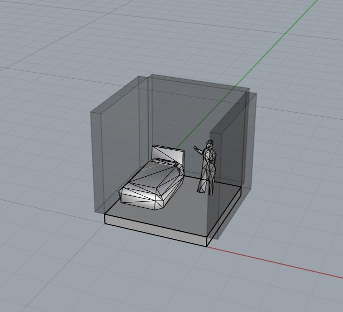

## Voxelsize
For this project we opted for a voxelsize of 3x3x3 meters. This is because we found the average ceiling height in The Netherlands is 2.6 m, this plus 0.4 m for the floor and installations comes down to around 3 meters. This was a usefull voxelsize to work with. Also in a room of 3x3 you can place furniture while also having place for people to walk. 

## Configuring and manifold

