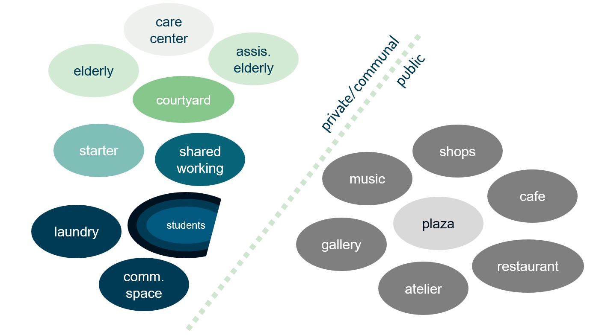

In Planning different types of criteria were established to be implemented in our project. In Configuring different types of data is gathered to create a voxel envelope that will be used for the massing of a building that follows the established criteria. The voxel envelope will be shaped through different measures and data will be integrated in the points of the voxel cloud. This happens in the following steps: 
- Adjacency of different functions
- Voxel size 
- Shadow casting
- Daylight analysis
- Calculating the distance values for each point
  

## Adjacency of different functions
<figure>
    
    <figcaption><i>Adjacency matrix visualized<i></figcaption>
</figure>

An adjacency matrix is drafted to show and use the importance of attraction and repulsion between functions. The scale works as follows: 1.00 = absolutely important, 0.75 = especially important, 0.5 = important, 0.25 = ordinary, 0 = unimportant. Positive values mean attraction and negative repulsion. 
For the public functions, a certain distance is wanted between them and the private communal garden. The communal garden should be an oasis of peace. However, the public functions should definitely  be near the public plaza, to create a lively place for the residents and visitors. 
For the dwellings, a nearness to the communal garden is preferred. A larger distance is required between the big student houses and the other houses. Nearness to the specific functions needed by the specific inhabitants is favored. 

## Voxelsize
For this project we opted for a voxelsize of 3x3x3 meters. This is because we found the average ceiling height in The Netherlands is 2.6 m, this plus 0.4 m for the floor and installations comes down to around 3 meters. This was a usefull voxelsize to work with. Also in a room of 3x3 you can place furniture while also having place for people to walk. 

### Shadow casting

### Daylight analysis

### Calculating the distance values for each point
In this section the distances that are relevant for the function placement are calculated. Some calculations are only used for the placement of the pedestrian, bike and car entrances, these are:
- distance to pedestrian roads
- distance to bike roads
- distance to car roads
- distance to public transport

After the entrances are placed, the distance to the different entrances is used. This is calculated in:
- distance to entrance

Further distances used are:
- distance to ground floor
- distance to plaza
- distance to facade

Finally, all the resulting values are copied into one pointcloud. 

#### Distances to streets, public transport and plaza
<figure>
    
    <figcaption><i>flowchart of distance to streets, public transport and plaza<i></figcaption>
</figure>

First a nearpoint calculation is performed between the points on the voxelcloud and the points from the line of the street or the points itself. For the distance to the public transport, the crossing points towards the public transport stops are used because people can’t directly cross the street toward them. 

<figure>
    
    <figcaption><i>Psuedo code nearpoint calculation<i></figcaption>
</figure>
 
Then the min and max values are found with the Min Max Average Node. In another attribute wrangle, the values are normalized to fit a range of 0 to 1, with 0 as furthest away and 1 as nearest. 

<figure>
    
    <figcaption><i>Psuedo code normalization<i></figcaption>
</figure>

 
##### Note on mainstreet distance
<figure>
    
    <figcaption><i>flowchart of distance to streets, public transport and plaza<i></figcaption>
</figure>
For the creation of weighting points in the next chapter, it is chosen to use the distance to the mainstreet as a substitute for the noise levels. The figure above shows that the main cause of noise for the building is the main street. Therefore it is chosen to use the distance to the main street as value for the noise exposure of the voxels.

#### Entrance distance

<figure>
    
    <figcaption><i>flowchart of distance to entrance<i></figcaption>
</figure>

For the entrance distance, the horizontal and vertical distance to the nearest entrance point are calculated separately so that they can be weighted differently. Going up takes more effort if the stairs are taken, therefore the vertical distance is multiplied by 2 in the adding together.

<figure>
    
    <figcaption><i>Psuedo code distance to entrance<i></figcaption>
</figure>

The same normalization as in distances to streets is used to get a 0-1 range. 

#### Ground floor distance

<figure>
    
    <figcaption><i>flowchart of distance to ground floor<i></figcaption>
</figure>

For the distance to the ground floor, only the Y component of the points is used. For each point in the pointcloud, their distance to the ground is calculated.

<figure>
    
    <figcaption><i>Psuedo code distance to entrance<i></figcaption>
</figure>

The same normalization as in distances to streets is used to get a 0-1 range. 

#### Facade distance 

<figure>
    
    <figcaption><i>flowchart of distance to facade<i></figcaption>
</figure>
For the facade distance, the distance to the most outer possible points is used. These come from the exterior points of the voxel cloud. The whole bottom row is removed due to the underground parking. The roof is also removed because this is not a facade.

<figure>
    
    <figcaption><i>Psuedo code getting the exterior points<i></figcaption>
</figure>

<figure>
    
    <figcaption><i>Psuedo code getting the facade points<i></figcaption>
</figure>

The same distance calculation is used as in distance to streets, only with facade points instead of street points. Also the same normalization as in distances to streets is used to get a 0-1 range. 

