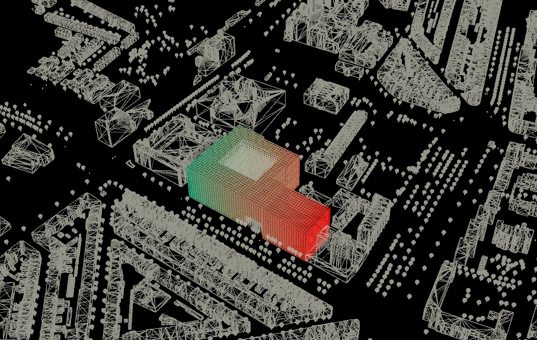
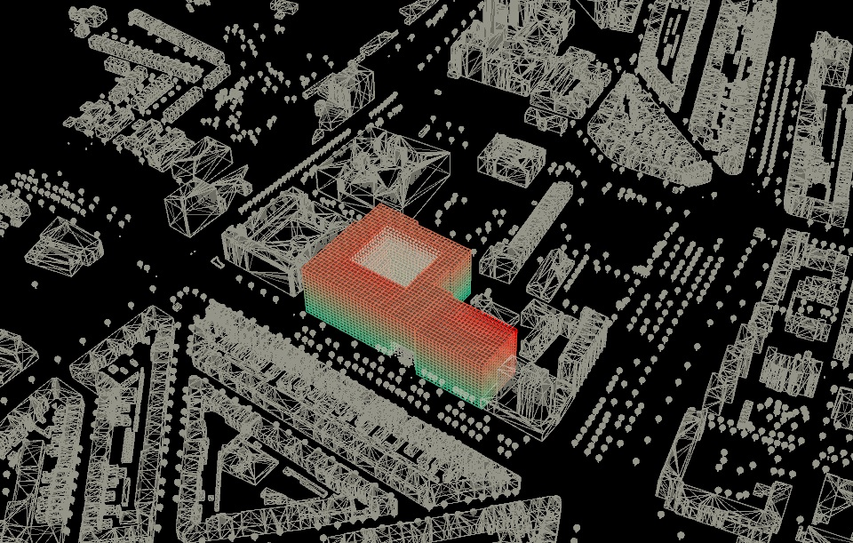
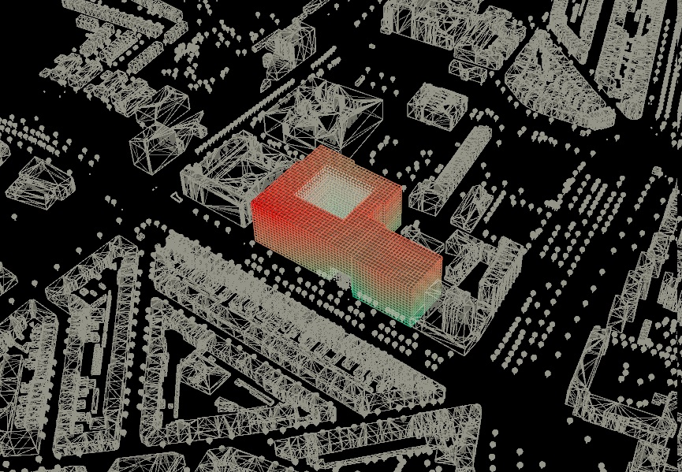
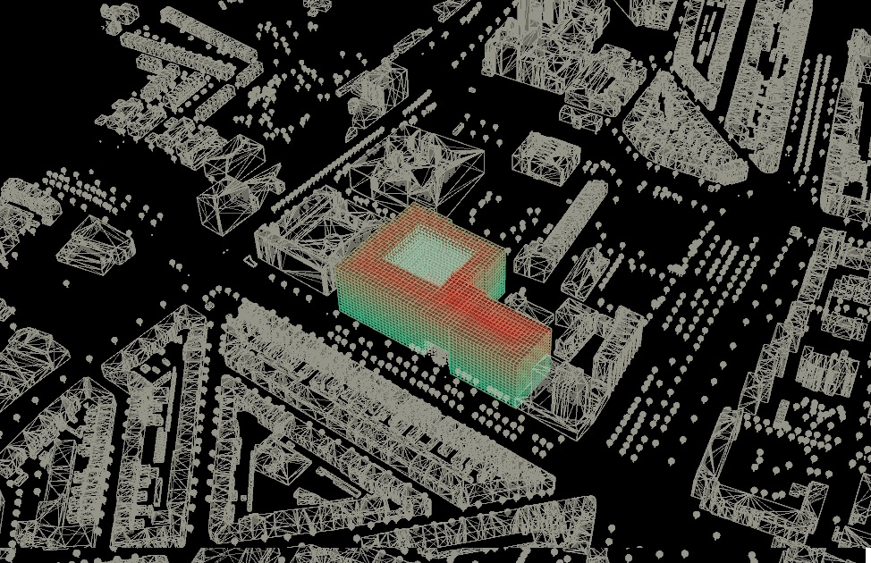
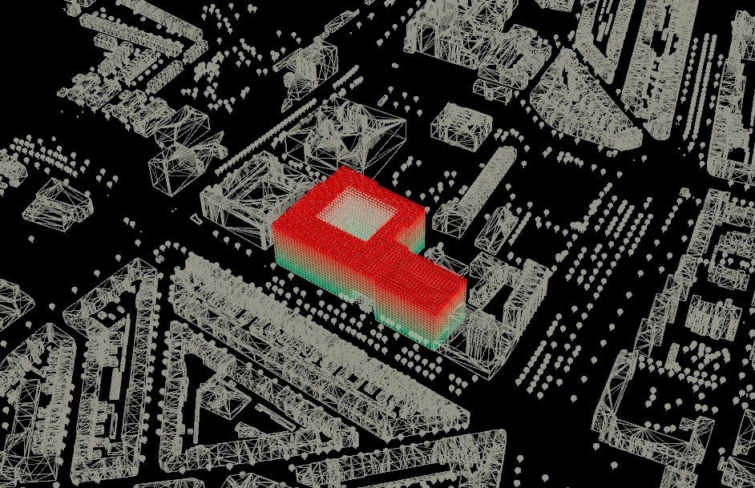

# Adjecency matrix different functions
The matrix table below shows the adjecency between different functions in the building. The values given to the adjecency matrix were based on personal experience as well as educated guesses. 
We discovered we need a total of 5453 voxels to fit all facilities and houses comfortably. The car park will be completely underground, the car park takes 1250 voxel, this means 4203 voxels must be above ground level.
There is also a courtyard places in the building that gives space for 1296 m^2 of greenery. This couryard also functions as a wadi where water can be collected.

|    | 0   | 1    | 2    | 3     | 4     | 5     | 6   | 7   | 8   | 9    | 10  | 11   | 12  | 13   | 14   | 15   | 16     | 17     | 18     | 19     | 20     | 21     | 22     |                                 |
| -- | --- | ---- | ---- | ----- | ----- | ----- | --- | --- | --- | ---- | --- | ---- | --- | ---- | ---- | ---- | ------ | ------ | ------ | ------ | ------ | ------ | ------ | ------------------------------- |
| 0  | 0.5 | 0.75 | 0.75 | 0     | 0     | 0     | 0   | 0.5 | 0.5 | 0.25 | 0.5 | 0.75 | 0.5 | 0.25 | 0.25 | 0    | 0      | 0      | 0      | 0      | 0      | 0      | 0      | 2-person student housing        |
| 1  |     | 0.75 | 1    | \-0.5 | \-0.5 | \-0.5 | 0   | 0.5 | 0.5 | 0.25 | 0.5 | 0.75 | 0.5 | 0.25 | 0.25 | 0    | 0      | 0      | 0      | 0      | 0      | 0      | 0      | 4-person student housing        |
| 2  |     |      | 1    | \-1   | \-1   | \-1   | 0   | 0.5 | 0.5 | 0.25 | 0.5 | 0.75 | 0.5 | 0.25 | 0.25 | 0    | 0      | 0      | 0      | 0      | 0      | 0      | 0      | 8-person student housing        |
| 3  |     |      |      | 1     | 0     | 0     | 0   | 0.5 | 0   | 0.25 | 0   | 0.75 | 0.5 | 0.5  | 0.5  | 0    | 0      | 0      | 0      | 0      | 0      | 0      | 0      | starter housing                 |
| 4  |     |      |      |       | 1     | 0.5   | 0.5 | 0   | 0   | 0.25 | 0   | 0.75 | 0.5 | 0.75 | 0.5  | 0.25 | 0      | 0      | 0      | 0      | 0      | 0      | 0      | unassisted elderly housing      |
| 5  |     |      |      |       |       | 1     | 1   | 0   | 0   | 0    | 0   | 0    | 0.5 | 0    | 1    | 0.5  | 0      | 0      | 0      | 0      | 0      | 0      | 0      | assisted elderly housing        |
| 6  |     |      |      |       |       |       | 1   | 0   | 0   | 0    | 0   | 0    | 0   | 0    | 0    | 0    | 0      | 0      | 0      | 0      | 0      | 0      | 0      | care center                     |
| 7  |     |      |      |       |       |       |     | 1   | 0   | 0.5  | 0   | 0    | 0   | 0    | 0    | 0    | 0      | 0      | 0      | 0      | 0      | 0      | 0      | shared working / study space    |
| 8  |     |      |      |       |       |       |     |     | 1   | 0    | 0   | 0    | 0   | 0.25 | 0    | 0    | 0      | 0      | 0      | 0      | 0      | 0      | 0      | general function communal space |
| 9  |     |      |      |       |       |       |     |     |     | 1    | 0   | 0    | 0   | 0    | 0    | 0    | \-0.25 | \-0.25 | \-0.25 | \-0.25 | \-0.25 | \-0.25 | \-0.25 | communal garden                 |
| 10 |     |      |      |       |       |       |     |     |     |      | 1   | 0    | 0   | 0    | 0    | 0    | 0      | 0      | 0      | 0      | 0      | 0      | 0      | laundry                         |
| 11 |     |      |      |       |       |       |     |     |     |      |     | 1    | 0.5 | 0.5  | 0.5  | 0.25 | 0      | 0      | 0      | 0      | 0      | 0      | 0      | lobby                           |
| 12 |     |      |      |       |       |       |     |     |     |      |     |      | 1   | 0    | 0    | 0    | 0      | 0.25   | 0      | 0.5    | 0      | 0      | 0      | car park                        |
| 13 |     |      |      |       |       |       |     |     |     |      |     |      |     | 1    | 0    | 0    | 0      | 0      | 0      | 0      | 0      | 0      | 0      | bicycle park                    |
| 14 |     |      |      |       |       |       |     |     |     |      |     |      |     |      | 1    | 0    | 1      | 0      | 0      | 0.5    | 0      | 0      | 0      | e-bicycle park                  |
| 15 |     |      |      |       |       |       |     |     |     |      |     |      |     |      |      | 1    | 1      | 1      | 0.5    | 0.5    | 1      | 1      | 1      | public bike park                |
| 16 |     |      |      |       |       |       |     |     |     |      |     |      |     |      |      |      | 1      | 0.5    | 0.5    | 0.5    | 0.5    | 0.5    | 0.5    | small public plaza              |
| 17 |     |      |      |       |       |       |     |     |     |      |     |      |     |      |      |      |        | 1      | 0      | 0      | 0      | 0      | 0      | music studio                    |
| 18 |     |      |      |       |       |       |     |     |     |      |     |      |     |      |      |      |        |        | 1      | 0      | 0      | 0.25   | 0      | atelier                         |
| 19 |     |      |      |       |       |       |     |     |     |      |     |      |     |      |      |      |        |        |        | 0.5    | 0      | 0      | 0      | commercial units (shops)        |
| 20 |     |      |      |       |       |       |     |     |     |      |     |      |     |      |      |      |        |        |        |        | 1      | 0      | 0      | art gallery                     |
| 21 |     |      |      |       |       |       |     |     |     |      |     |      |     |      |      |      |        |        |        |        |        | 0.5    | 0      | cafe                            |
| 22 |     |      |      |       |       |       |     |     |     |      |     |      |     |      |      |      |        |        |        |        |        |        | 1      | restaurant                      |

# Number of voxels needed per function 

| **Housing**                         |          |          |           |            |                 |         |                |       |      |
| ------------------------------- | -------- | -------- | --------- | ---------- | --------------- | ------- | -------------- | ----- | ---- |
| Type of housing                 | amount n | size m^2 | total m^2 | voxel 3x3m | how many people | balcony | electric bikes | bikes | cars |
| 2 person                        | 70       | 54       | 3780      | 420        | 140             | yes     | 0              | 182   | 40   |
| 4 person                        | 35       | 108      | 3780      | 420        | 140             | yes     | 0              | 182   | 40   |
| 8 person                        | 15       | 207      | 3105      | 345        | 120             | yes     | 0              | 160   | 30   |
| starter housing                 | 200      | 54       | 10800     | 1200       | 300             | yes     | 0              | 230   | 150  |
| unassisted elderly housing      | 100      | 54       | 5400      | 600        | 150             | yes     | 80             | 70    | 100  |
| assisted elderly housing        | 100      | 54       | 5400      | 600        | 100             | yes     | 10             | 0     | 10   |
| sum                             | 520      | 531      | 32265     | 3585       | 950             | yes     | 90             | 824   | 370  |
| **Facilities**                 |        |       |        |          |         |      |      |     |    |
| care center                     | 1        | 45       | 45        | 5          | \-              | no      | \-             | \-    | \-   |
| shared working / study space    | 1        | 351      | 351       | 39         | \-              | no      | \-             | \-    | \-   |
| general function communal space | 1        | 207      | 207       | 23         | \-              | no      | \-             | \-    | \-   |
| communal garden                 | 1        | 405      | 405       | 45         | \-              | no      | \-             | \-    | \-   |
| laundry                         | 3        | 450      | 1350      | 150        | \-              | no      | \-             | \-    | \-   |
| lobby                           | 1        | 207      | 207       | 23         | \-              | no      | \-             | \-    | \-   |
| car park                        | 450      | 25       | 11250     | 1250       | \-              | no      | \-             | \-    | \-   |
| bicycle park                    | 824      | 0,9      | 741,6     | 82,4       | \-              | no      | \-             | \-    | \-   |
| e-bicycle park                  | 90       | 1,1      | 99        | 11         | \-              | no      | \-             | \-    | \-   |
| public bike park                | 176      | 0,9      | 158,4     | 17,6       | \-              | no      | \-             | \-    | \-   |
| small public plaza              | 1        | 270      | 270       | 30         | \-              | no      | \-             | \-    | \-   |
| music studio                    | 1        | 108      | 108       | 12         | \-              | no      | \-             | \-    | \-   |
| atelier                         | 1        | 108      | 108       | 12         | \-              | no      | \-             | \-    | \-   |
| commercial units (shops)        | 4        | 288      | 1152      | 128        | \-              | no      | \-             | \-    | \-   |
| art gallery                     | 1        | 153      | 153       | 17         | \-              | no      | \-             | \-    | \-   |
| cafe                            | 1        | 54       | 54        | 6          | \-              | no      | \-             | \-    | \-   |
| restaurant                      | 1        | 153      | 153       | 17         | \-              | no      | \-             | \-    | \-   |
| Total                           | \-       | \-       | 16812     | 1868       | \-              | no      | \-             | \-    | \-   |
| Facilities + housing together                    | \-       | \-       | 32418     | 5453       | \-              |         | \-             | \-    | \-   |

## Distance calculations

<figure>
    
    <figcaption><i>Bike distance to voxels<i></figcaption>
</figure>

<figure>
    
    <figcaption><i>Public transport distance to voxels<i></figcaption>
</figure>

<figure>
    
    <figcaption><i>Pedestrian distance to voxels<i></figcaption>
</figure>

<figure>
    
    <figcaption><i>Car distance to voxels<i></figcaption>
</figure>

<figure>
    
    <figcaption><i>Entrance distance to voxels<i></figcaption>
</figure>

<figure>
    
    <figcaption><i>Facade distance to voxels<i></figcaption>
</figure>

<figure>
    
    <figcaption><i>Ground floor distance to voxels<i></figcaption>
</figure>