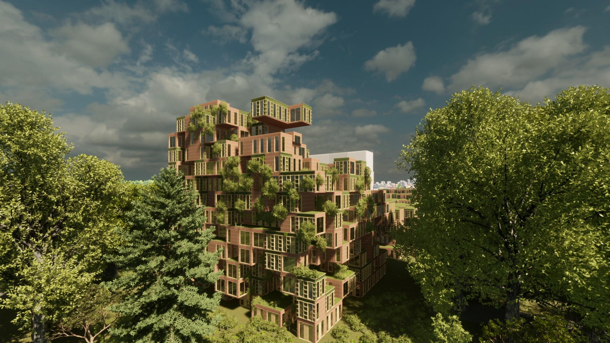

# Welcome to the home of the 'Stepping stone' 

 
*Picture of final product*

The Stepping Stone is a building that represents the progress of a project where one has to follow different steps to reach the end goal. In a staircase one has different steps and has to follow these steps in a specific order to reach the top floor. This is what it felt like to work on this project, since building procedurally takes a specific type of design process, where you can only continue when the last step is completed. The theme of the stepping stone is also recurring when looking at the facade, where moving bricks make the street more visually interesting. 

This website was created for the course Computational Design studio, given in the minor Spatial Computing at the TU Delft, at the faculty of Architecture and the Built Environment. It is made to show the process of making a procedurally designed building with the help of SideFX Houdini. The goal of the exersice is to make a the optimal building for the surrounding and for the residents of the building itself. This is done with making different rules defining the criteria we find important to take into account. We are the fifth generation students working on this minor, but we are the first to use Sidefx Houdini. On this site, we will document the process behind our final product. The project is divided in four fases: Planning, Configuring, Massing and Forming. Finally we will present the final building and we will share our thoughts and comments for future students about this minor.

<pre><code> The following list of criteria was given:
- 400 student units
- 200 elderly units
- 200 starter units
Criteria:
- All dwelling must have daylight
- Housing >40m^2 at least 5m^2 outdoor space
- Min 25m^2 own space per student but combined living is allowed
- Elderly must vary between 50m^2 and 80m^2, assisted and unassisted living possibilities
    - Assisted living needs a strong link with elements as care center
    - All must be single-level and have >5m^2 outdoor space
- Parking 1.2 car per dwelling and 1.33 bike per dwelling
- 10 bike parking spots and 5 car parking spots per 100m^2 additional program
- Total 10.000 m^2 greenery on the plot
- Incorporate a system for rain harvesting
- Have a degree of social control

- The design goal should be to:
    - minimize the blocking of sunlight on the neighbouring buildings,
    - minimize noise,
    - maximize social integration,
    - provide a balance between privacy and community,
    - avoid wind pollution </code></pre>

The group working on this project consists of four bachelor students, coming from the TU Delft bachelors architecture and computer science.

## We are
<pre><code> Jessica Monahan - Bouwkunde </code></pre>
<pre><code> Pauline Hengst - Computer Science </code></pre>
<pre><code> Bogdan Buzatu - Computer Science </code></pre>
<pre><code> Noor van Everdingen - Bouwkunde </code></pre>

## We were taught by
<pre><code> ir. Hans Hoogenboom (TU Delft, Design Informatics) </code></pre>
<pre><code> ir. Puck Flikweert (CGI Nederland) </code></pre>
