# Process of massing
In Forming we established different criteria we find important to implement in our project. This is a recap of the matters we wanted to take into account. 

- Sun casting
- Shadow casting
- Keeping bike path clear
- Agent-based function placement using distance optimization per function
- Comfortable housing
- Giving natural light 
- Combined living
- Seperation public and private
- Adding available facilities 

In Massing these criteria will be implemented with different methodologies. For placing the interior functions we used agent-based modelling. The steps we use when creating our building are illustrated in the following flowchart:

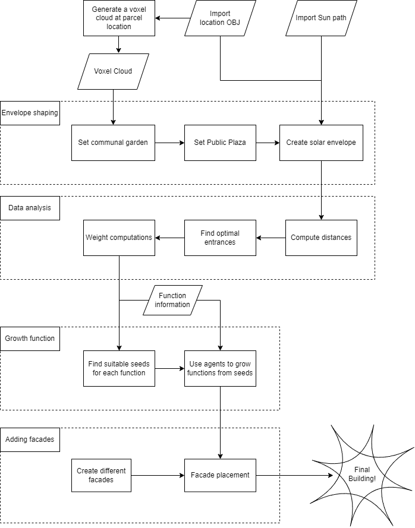 

### Voxelization

 
 We started the project by creating a point cloud. At the final stage of the process, this point cloud will have a voxel copied to each point, each point containing the information of a voxel. As such the point cloud is henceforth reffered to as the voxelcloud.

 The point cloud is created using a grid, with a cell size equal to the voxel size, from which the centroids are extracted. This grid is combined with an OBJ file representing the buildings surroundings; the grid is translatred to the parcel location, and bounded to the volume that exists above the parcel. This results in a voxel cloud representing the maximum volume that the building can use, as shown below. The process is also summarized in a flowchart.

 

 <!--- This is the flowchart: -->
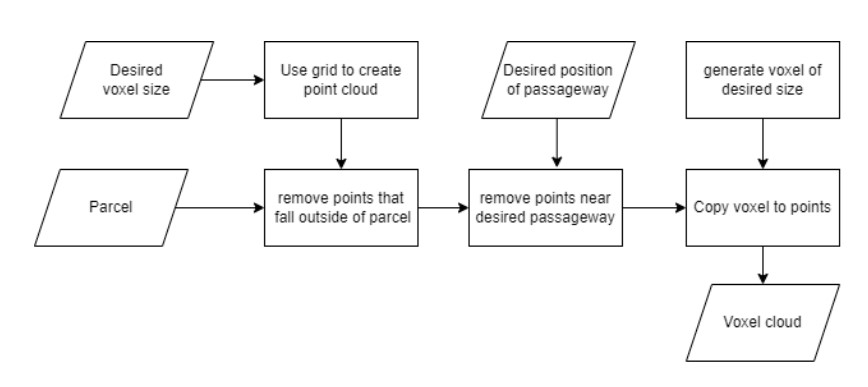 

### Cutting out the Garden and bikepath

#### Garden placement

The first step of shaping the envelope is the placement of the communal garden. This is a space intended for the residents of the building, so it is desired to be placed near the center of the mass of the existing voxel cloud. 

We achieve this in houdini by starting with a grid at the desired location of the garden, of the desired size. We then perfom a ploy extrude with a negative index to produce the volume above the garden plane, such that more points are removed per level above the ground floor. After this, the points from the voxel cloud are grouped dependen on if they located within the volume. The group of points within the volume is then traversed; those on the ground floor are marked as being in the garden, and the rest are removed from the voxel cloud. Notably, the points under the garden are also removed, this is done to grant the trees in the garden space to grow thier root systems. 

#### Plaza cutout

After placing the garden, it was decided to also place a plaza. It was desired for the plaza to be placed at a point were commuters are likely to walk through the building, so it was placed where currently a road exists in real life.

This was achieved by creating a curve object in Houdini to represent the road along which the plaza is to be cut out of the voxel cloud. From here we use an attribute wrangle node to: input the deisred width and height  of the cutout using sliders, remove points from the voxel cloud that are within 'width' horizontal distance  and 'height' vertical  distance from points on the road_curve. Points that hold for both these conditions and are on the ground floor are marked as being part of the plaza. 

After performing these operations, this is the result:

### Cutting the envelope
### Calculating the distances
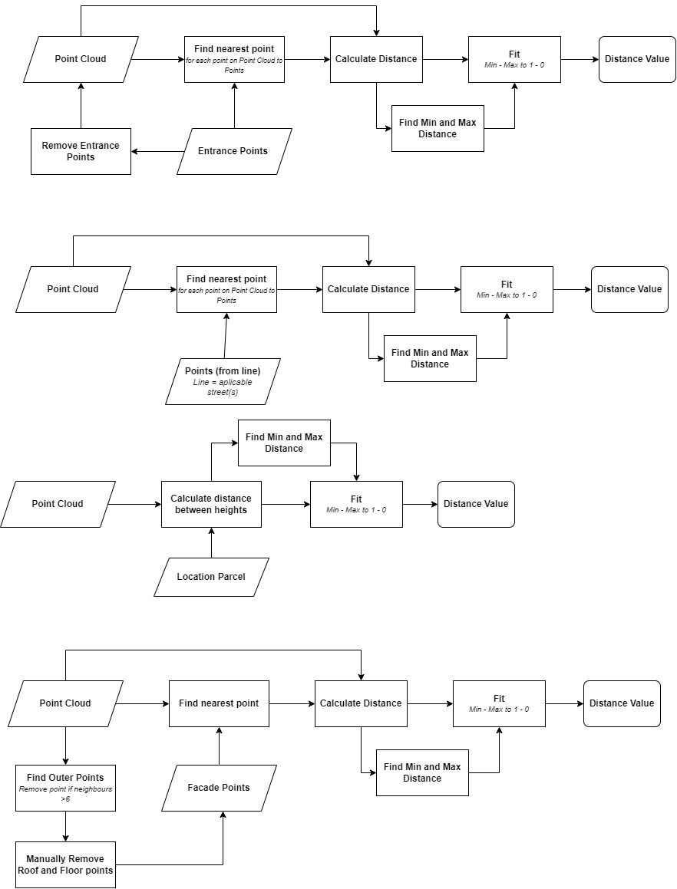
### Sun Analysis 
For the sun analysis, we have used the material given during the Houdini Workshop regarding Sun Analysis. The geo node structure used for Shadow Casting, Daylight Analysis and Sunlight Analysis is similiar to the ones mentioned and created in the following project of BK7083 (Reference: https://github.com/Pirouz-Nourian/Spatial_Computing_Design_Studio19/tree/master/Oasis )

#### Shadow casting
The purpose of shadow casting is to determine how much shadow is going to be produced by our building towards the environment. We would like to small influence on the environment, therefore with shadow casting we are changing the size of the voxel cloud. 

The input of the node would include the point cloud data of the voxels, the sun path (which is imported using a CSV from https://www.sunearthtools.com/dp/tools/pos_sun.php?lang=en) . The Python node that is used for converting the CSV data into Voxel Point is from the Houdini Workshop for this specific topic. The last input is the environment.

In a attribute wrangle, we are a calculating how much shadow is produced by each of the input voxel points. We are casting a ray from each voxel point towards each of the points in the sun path. If the ray is not interescting anything on its way towards the sun path points, it means that the respective point is going to receive light. In this case, we are casting another ray in the opposite direction. If this ray is intersecting a point in the environment, it means that it is going to produce towards the enviroment. After the calculation, the voxel cloud is going to include the 'ratio' attribute which states the amount of shadow that is produced with regards to the points of the sun path. The 'ratio' has values from 0 to 1 where 0 means that the respective voxel point of the building produces no shadow and 1 means the opposite.

We establish a threshold for which we determine the shape of the point cloud data. Since there are some floating point after the computation, we are removing them manually.

*Resulting Voxel Building After Computing the Shadow Casting*
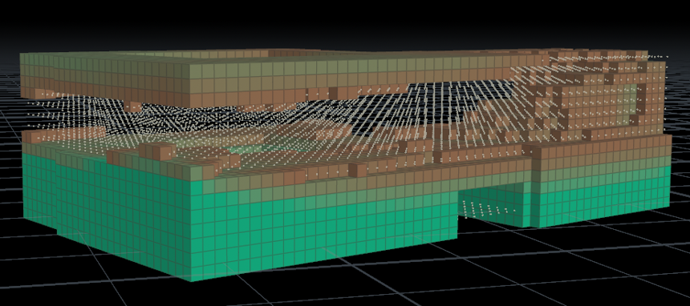

*Process flowchart*
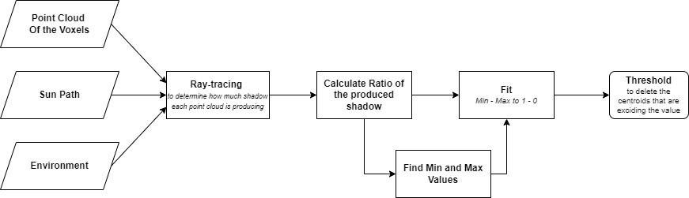
#### Daylight analysis

The purpose of shadow casting is to determine how much light coming from the sky ( The Sky Simulation node is used from the 'Oasis' project mentioned above ) during the day would be perceived by each of voxels of the building.

In a attribute wrangle, we are casting a ray from each voxel point towards each of the points in the sky simulation. If the ray is not interescting anything on its way towards the sky simulation points, it means that the respective point is going to receive light.  After the calculation, the voxel cloud is going to include the 'ratio' attribute which states the amount of day light that is receieved by each voxel point. The 'ratio' has values from 0 to 1 where 0 means that the respective voxel point of the building receives 0 day light from the sky and 1 means the opposite.

*Resulting computation*
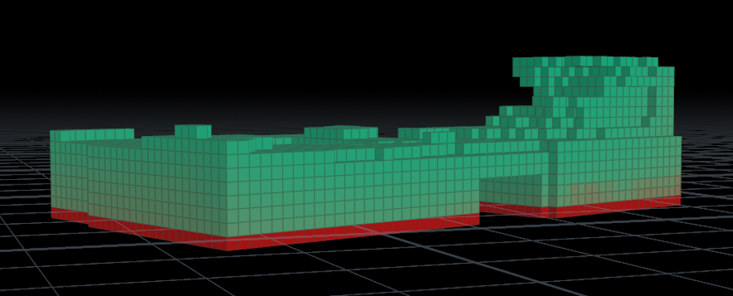

*Process Flowchart*
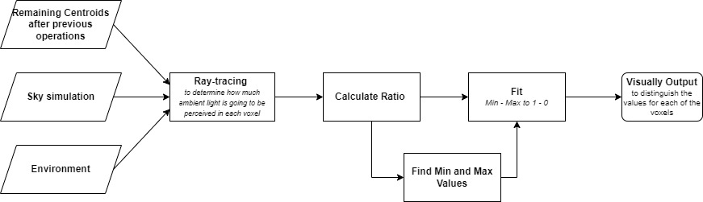

#### Sunlight analysis
The purpose of shadow casting is to determine how much light coming from the sun path would be perceived by each of voxels of the building.

In a attribute wrangle, we are casting a ray from each voxel point towards each of the points in the sun path. If the ray is not interescting anything on its way towards the sky simulation points, it means that the respective point is going to receive light.  After the calculation, the voxel cloud is going to include the 'ratio' attribute which states the amount of sun light that is receieved by each voxel point. The 'ratio' has values from 0 to 1 where 0 means that the respective voxel point of the building receives 0 sun light from the sky and 1 means the opposite.

*Resulting computation*
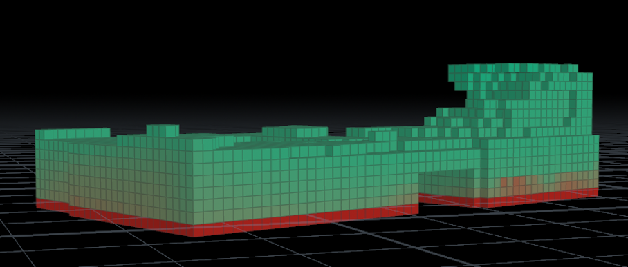

*Process Flowchart*
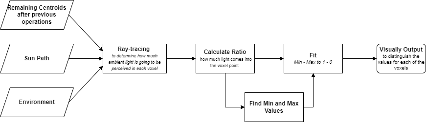

### Weighting points

The weights for both the Entrance placement and the Functions value calcultation after having a brain storm on how much each of different types of values would influence the placement of a certain entrance or room. The tables used for weights are given in the Product part of this chapter.

#### Entrance placement 

The already computed values taken into account for the entrance placement: 

- Pedestrian Value
- Bike Value
- Car Value
- Main street Distance
- Plaza Distance
- Ground floor Distance 
- Facade Distance

In order to determine the most suitable position for each of the entrances, we are determining the values for each voxel point corresponding to the weights of each type of entrances. Therefore, WLC ( weighted linear combination) is the most suitable for such purpose. In the Attribute Wrangle ( attribwrangle1)  that is present in the mention geo node, we are looping over each voxel point. While looping over each voxel point , we are also looping over the table that has the desired Weights. Since in that table there are multiple columns, for each of them corresponding to function( Distance to bike lane or Distance to main street etc.), we multiplying the corresponding weight  with the corresponding value function. After looping over all the functions, we are summing up all the values and add the value to the corresponding column ( depending on the type of the entrance).

After determining the values for each voxel point corresponding to each type of entrance, we are determining the maximum for each type of the entrance. First, we are determining the maximum for the pedestrian entrance and assign that voxel point and its neighbour to the corresponding entrance. We are removing those points to compute the next entrance. After all the entrances are determined, we are merging everything. 

*Resulting computation*
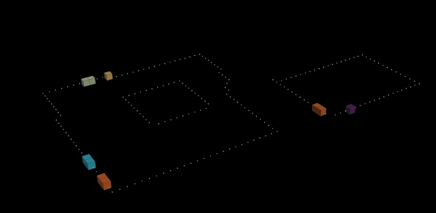

*Process Flowchart 1*
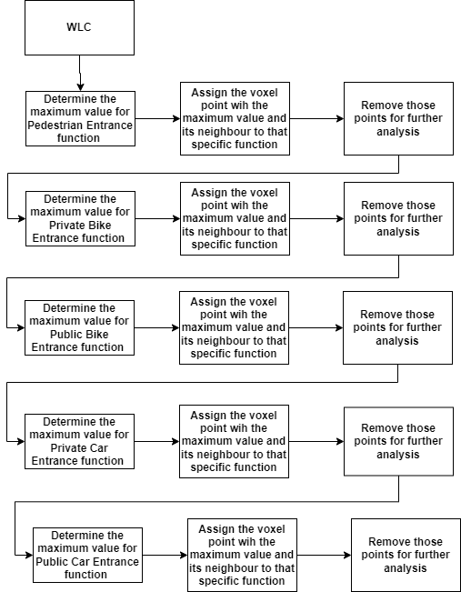

*Process Flowchart 2*
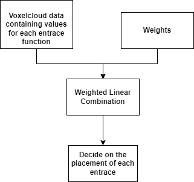

#### Function value calculation

The already computed values taken into account for each voxel cloud: 

- Pedestrian Entrance Distance
- Private Bike Entrance Distance
- Public Bike Entrance Distance
- Private Car Entrance Distance
- Public Car Entrance Distance
- Courtyard Distance
- Main street Distance
- Plaza Distance
- Ground floor Distance 
- Facade Distance
- Sunlight Values
- Daylight Values

In order to determine the values  for each of the functions ( type of rooms), we are determining the values for each voxel point corresponding to the weights of each type of function. Therefore, WLC ( weighted linear combination) is the most suitable for such purpose. In the Attribute Wrangle ( attribwrangle1)  that is present in the mention geo node, we are looping over each voxel point. While looping over each voxel point , we are also looping over the table that has the desired Weights. Since in that table there are multiple columns, for each of them corresponding to function, we multiplying the corresponding weight  with the corresponding value function. After looping over all the functions, we are summing up all the values and add the value to the corresponding column ( depending on the type of the function).

*Process Flowchart*
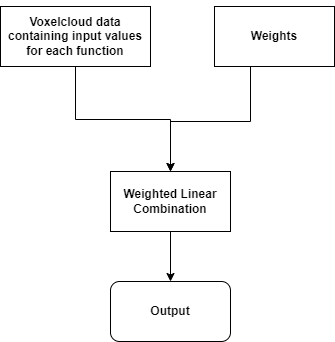

### Growth seed placement

To work properly, the growth agents needs given starting points to start placing functions. From these starting points (from now reffered to as seeds) an agent will find the next suitable candidate voxel for a function to be placed.

It was noticed that simply placing seeds at the points in the point cloud with the highest function weight resulted in seeds being placed in mid-air, which resulted the final functions sometimes being disconnected from the ground. As this was very out of line with our design principles (accessible & in touch with surroundings !!is this in design principles!!) we decided to define more advanced methods for seed placement.

Implementing a seed placement function required us to define the desired behaviour. First of all, we dicussed & decided on functions that would need 'special' placement. These are functions that according to our design principles and design brief must be placed near or adjacent to specific other functions, as a hard requirement. This resulted in the following placement rules:
- **All** functions will be placed on the ground floor.
- The **care center** must be adjacent to the **assisted elderly housing**, as specified in the design brief.
- The **cafe** and **restaurant** must be adjacent to the **public plaza**, so that they can make use of the plaza space.
- The **shops**, **atelier**, **art gallery**, and **music studio** must border the perimiter of the buildings, as to be more accesible to the public.
- The **communal garden**, **public plaza** and parking functions do not require seeds, as they are manually placed.

The implementation concept of placing seeds in this manner is shown in the following flowchart, and a short explanation per node is given.

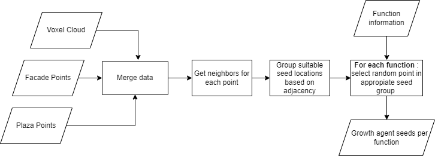 

1. *Merge data* : the points given as facade are merged with the given voxel cloud points using an `Attribute Copy` node, reuling in a group of facade points. Points on the public plaza are already labelled

2. *Get neighbors for each point* : Neighbors per point are found using the vex *nearpoints* function.

3. *Group suitable seed locations...* : We iterate over all points in the voxel cloud. Per point:
	- Filter based on the level of the point. All points on the 0th floor are underground and dedicated to parking, so only points on the 1st floor are considered.
	- Iterate over the neighbors of each point, and check their type. If a neighbor is found to be part of the plaza or facade point, the point is added to the corresonding groups 'plaza_adj' or 'facade_adj'. If the point is not adjacent, it is added to the group 'ground_floor'.
4. *For each function...* : We select the actual seed locations by iterating over the desired functions, and applying the appropriate placement rules for each function. As we have grouped the points, we can simply pick a random point in the suitable group as a seed location for each function. Picking a random point per group is done by seperating each group as a new list of points (before the seed placement), and picking the point with index `rand(function_id) * len(seed_group)` as the seed. The care center and assisted elderly housing are an exception to this, the care center is simply placed at a random direct neghbor of the seed of the assisted elderly housing seed.

The resulting seed locations can be found in [this page](https://bogdanbuzatu04.github.io/ComputationalDesign/massing_product.html).

### Growth function
For this project, we decided to use the agent growth model written by Shervin Azadi and Jonas Althuis(2020), which was provided to us. We modified it to ignore the 'flatness' and 'blockiness' factors, which were parameters given per function used to define the shaping. This was decided because these factors were not considered in our initial design decisions, and changing design at a late stage in the project was deemed undesireable.

The growth agent works as shown in the following flowchart:

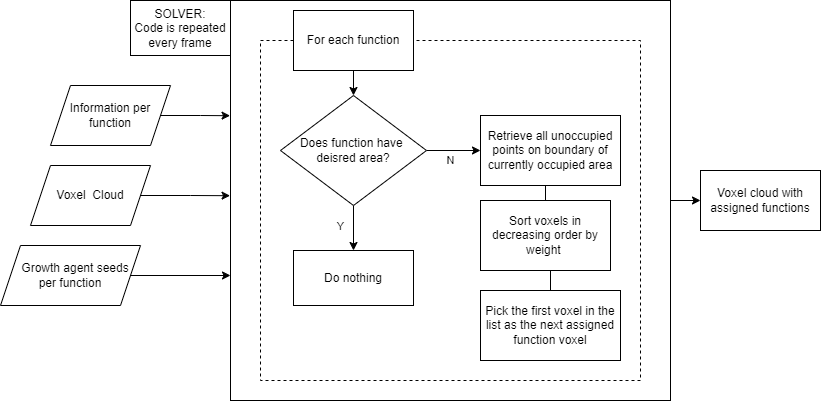 

For futher implementation details consult : [Oasis Documentation](https://github.com/Pirouz-Nourian/Spatial_Computing_Design_Studio19) 

The result of applying the growth function with the seeds is shown in the following two gifs:

 
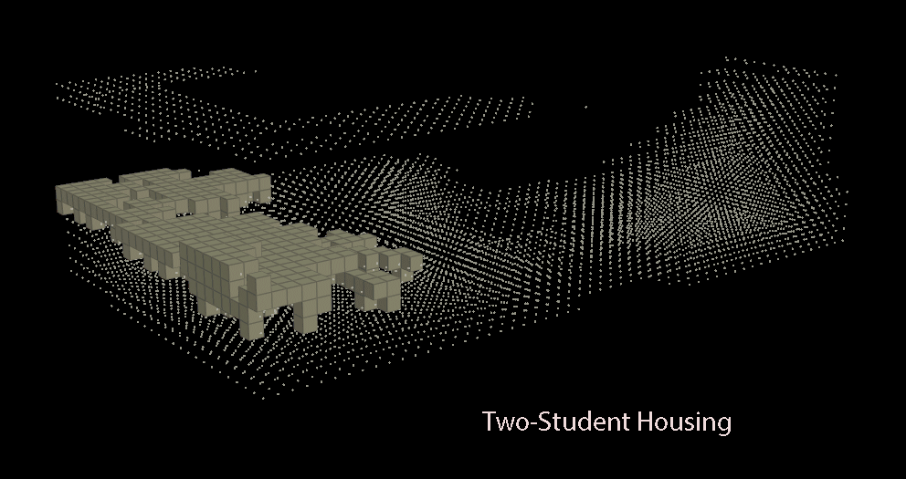 

### Generating facades

### Placing facades on the generated building