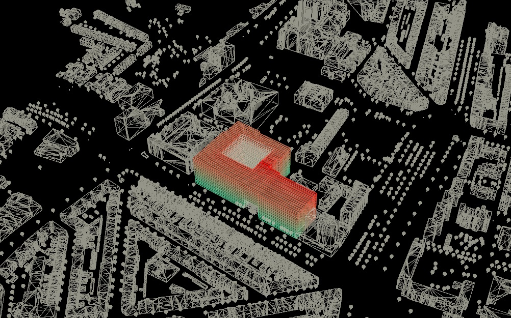
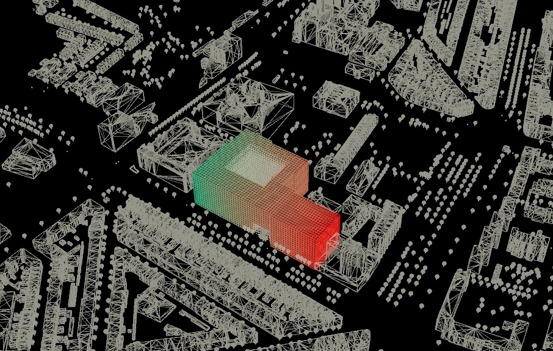
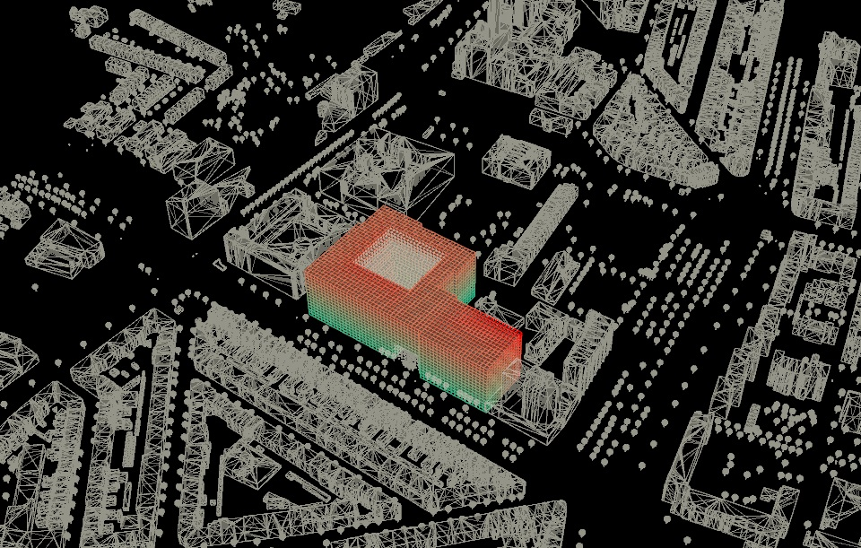
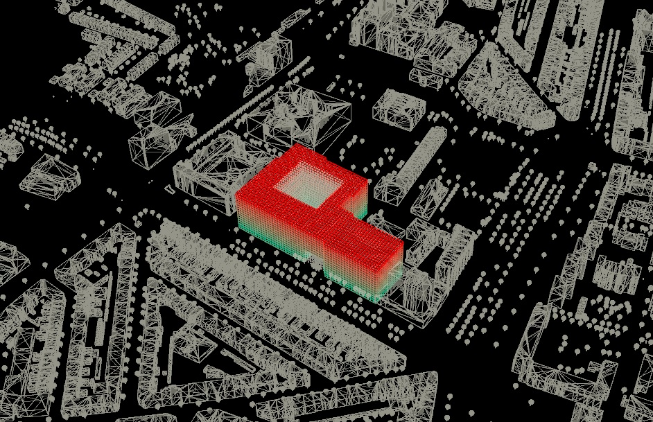
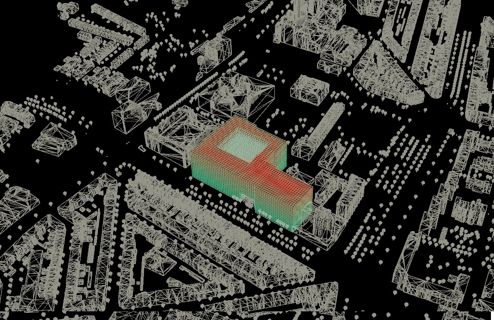

## Distances
 

*Bike distance to voxels*

 

*public transport distance to voxels*

 

*Pedestrian distance to voxels*

 

*Groundfloor distance to voxels*

 

*Facade distance to voxels*

 

*Entrance distance to voxels*

 

*Car distance to voxels*

## Weight Table for Entrance Placement

| Function              | Bike_weight | Car_weight | Ped_weight | PT_weight | MS_weight | GF_weight | Fac_weight |
|:---------------------:|:-----------:|:----------:|:----------:|:---------:|:---------:|:---------:|:----------:|
| Pedestrian Entrance   | 0           | 0          | 1          | 0.7       | 0.6       | 1         | 1          |
| Private_Bike_Entrance | 1           | 0          | 0          | 0         | 0         | 1         | 1          |
| Public_Bike_Entrance  | 0.8         | 0          | 0          | 0         | 0.2       | 1         | 1          |
| Public_Car_Entrance   | 0           | 0.5        | 0          | 0         | 0.1       | 1         | 1          |
| Private_Car_Entrance  | 0           | 1          | 0          | 0         | 0         | 1         | 1          |

## Weight Table for Function Value Calculation

| Function                        | Id | Pedestrian Entrance | Private Bike Entrance | Public Bike Entrance | Public Car Entrance | Private Car Entrance | MS_Val | GF_Val | Fac_Val | courtyard | plaza |
|:-------------------------------:|:---:|:-------------------:|:---------------------:|:--------------------:|:-------------------:|:--------------------:|:------:|:------:|:-------:|:---------:|:-----:|
| 2-person student housing        | 0  | 0.3                 | 0.6                   | 0                    | 0                   | 0.2                  | -0.4   | 0      | 0.8     | 0.3       | -0.2  |
| 4-person student housing        | 1  | 0.3                 | 0.6                   | 0                    | 0                   | 0.2                  | -0.2   | 0      | 0.8     | 0.2       | 0     |
| 8-person student housing        | 2  | 0.3                 | 0.6                   | 0                    | 0                   | 0.2                  | -0.1   | 0      | 0.8     | 0.2       | 0     |
| starter housing                 | 3  | 0.5                 | 0.5                   | 0                    | 0                   | 0.5                  | -0.6   | 0      | 0.8     | 0.5       | -0.3  |
| unassisted elderly housing      | 4  | 0.5                 | 0.2                   | 0                    | 0                   | 0.6                  | -0.7   | 0.5    | 0.8     | 0.5       | -0.4  |
| assisted elderly housing        | 5  | 0.5                 | 0.2                   | 0                    | 0                   | 0.6                  | -0.7   | 0.5    | 0.8     | 0.5       | -0.4  |
| care center                     | 6  | 0.2                 | 0.4                   | 0                    | 0                   | 0.5                  | -0.5   | 0.5    | 0.5     | 0.1       | -0.4  |
| shared working / study space    | 7  | 0.2                 | 0.4                   | 0                    | 0                   | 0.2                  | -0.5   | 0      | 0.8     | 0.8       | -0.4  |
| general function communal space | 8  | 0.3                 | 0.3                   | 0                    | 0                   | 0                    | 0      | 0      | 0       | -0.5      | 0     |
| communal garden                 | 9  | 0                   | 0                     | 0                    | 0                   | 0                    | 0      | 0      | 0       | 0         | 0     |
| laundry                         | 10 | 0                   | 0                     | 0                    | 0                   | 0                    | 0      | 0      | 0       | 0         | 0     |
| lobby                           | 11 | 1                   | 0.5                   | 0.2                  | 0.2                 | 0.5                  | 0      | 1      | 0.8     | 0.2       | 0     |
| car park                        | 12 | 0                   | 0                     | 0                    | 0                   | 0                    | 0      | 0      | 0       | 0         | 0     |
| bicycle park                    | 13 | 0                   | 1                     | 0                    | 0                   | 0                    | 0      | 1      | 0       | 0         | 0     |
| e-bicycle park                  | 14 | 0                   | 1                     | 0                    | 0                   | 0                    | 0      | 1      | 0       | 0         | 0     |
| public bike park                | 15 | 0                   | 0                     | 1                    | 0                   | 0                    | 0      | 1      | 0       | 0         | 0.5   |
| public plaza                    | 16 | 0                   | 0                     | 0                    | 0                   | 0                    | 0      | 0      | 0       | 0         | 0     |
| music studio                    | 17 | 0                   | 0                     | 0.7                  | 0.5                 | 0                    | 0.3    | 0.5    | 0.8     | 0         | 0.8   |
| atelier                         | 18 | 0                   | 0                     | 0.7                  | 0.5                 | 0                    | 0.4    | 0.5    | 0.8     | 0         | 1     |
| commercial units (stores)       | 19 | 0                   | 0                     | 0.5                  | 0.5                 | 0                    | 1      | 1      | 0.8     | -0.2      | 1     |
| art gallery                     | 20 | 0                   | 0                     | 0.7                  | 0.7                 | 0                    | 0.2    | 1      | 0.8     | -0.2      | 0.6   |
| cafe                            | 21 | 0                   | 0                     | 0.7                  | 0.5                 | 0                    | 0.5    | 1      | 0.8     | -0.2      | 1     |
| restaurant                      | 22 | 0                   | 0                     | 0.5                  | 0.7                 | 0                    | 0.5    | 1      | 0.8     | -0.2      | 1     |

## Growth seed placement

 

*Seeds of the Atelier, Art studio, and music studio*

 

*Seeds of the Cafe, Restaurant, and shops*

 

*Seeds of the remaining functions*

